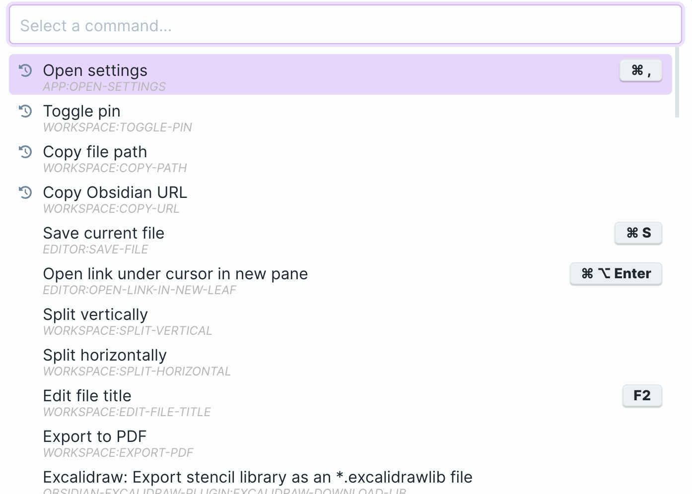
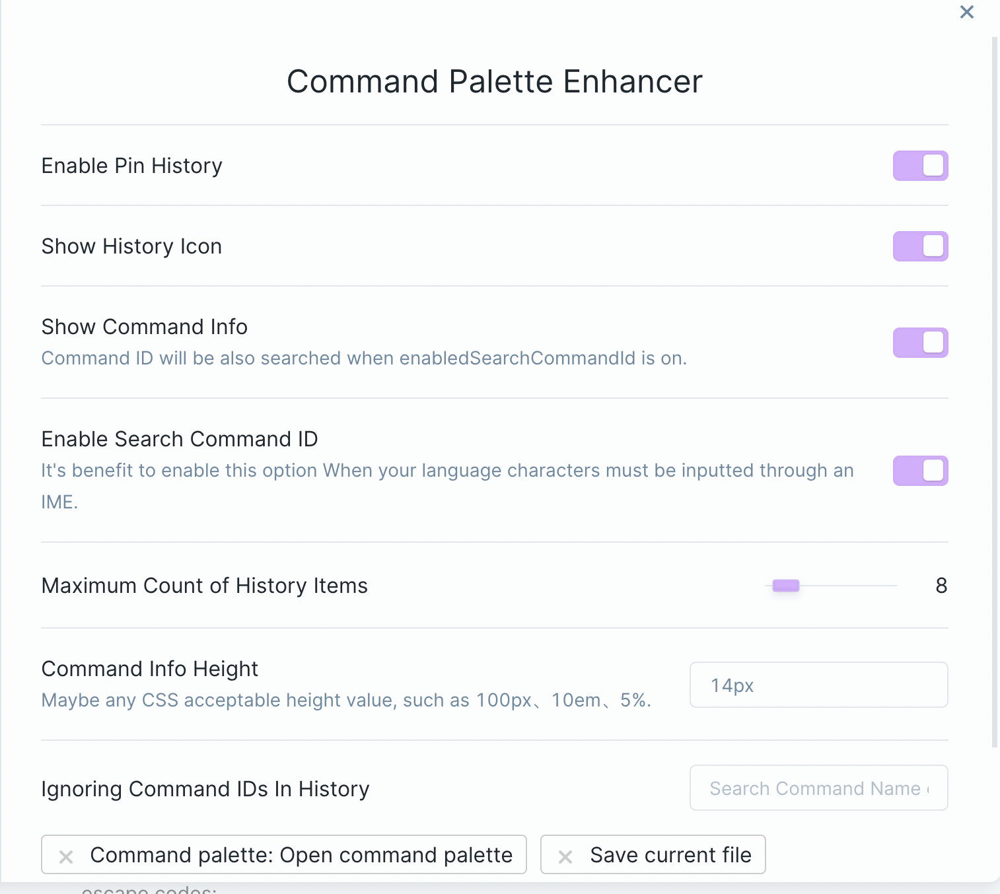
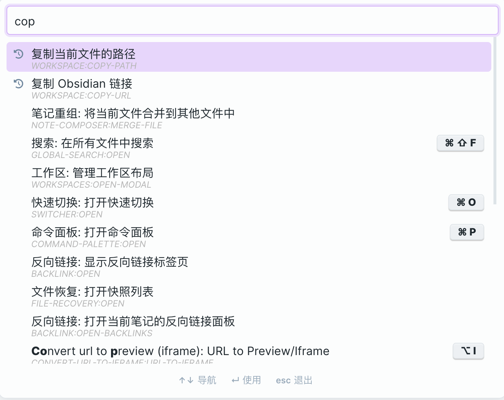

## Obsidian Command Palette Enhancer

> Pin recent(history) commands, fuzzy search supports command id, and maybe more is coming...

- (Configurable, see below) Pin recent commands (through both hotkeys and select from command palette).

- 允许搜索命令ID，对中文等输入法输入的语言比较友好。

- Maybe more..., welcome to tell me what your wants.

## LICENSE

MIT
